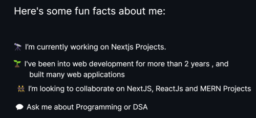
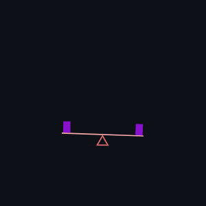

### Hi there 👋

Connect with me on
 	
<a target="_blank" href="https://www.linkedin.com/in/krishna-kudari-5238041b6/"></img></a>
&emsp;
<a target="_blank" href="mailto:Kkrishna22572@gmail.com"
></img></a>
&emsp;

## 🛠️ My Skills

### 👉 Programming languages
[![Java shield][java-shield]][java-url]
[![JavaScript shield][javascript-shield]][javascript-url]

### ⭐⭐ DSA Learning
[![LeetCode shield][leetcode-shield]][leetcode-url]

[leetcode-shield]: https://img.shields.io/badge/LeetCode-v1.0-pink?style=for-the-badge&logo=leetcode&logoColor=white&color=FFA116&labelColor=000000
[leetcode-url]: https://leetcode.com/Kkrishna22572

### 👉 Frameworks
[![Next.js shield][nextjs-shield]][nextjs-url]
[![React.js shield][reactjs-shield]][reactjs-url]
[![Node.js shield][nodejs-shield]][nodejs-url]
[![Express shield][express-shield]][express-url]

[nodejs-shield]: https://img.shields.io/badge/Node.js-v14.18.0-pink?style=for-the-badge&logo=node.js&logoColor=white&color=339933&labelColor=000000
[nodejs-url]: https://nodejs.org/
[express-shield]: https://img.shields.io/badge/Express-v4.17.1-pink?style=for-the-badge&logo=express&logoColor=white&color=000000&labelColor=000000
[express-url]: https://expressjs.com/

### 👉 Databases & Cloud Hosting
[![MySQL shield][mysql-shield]][mysql-url]
[![PostgreSQL shield][postgresql-shield]][postgresql-url]
[![Firebase shield][firebase-shield]][firebase-url]
[![Supabase shield][supabase-shield]][supabase-url]
[![MongoDB shield][mongodb-shield]][mongodb-url]

[mysql-shield]: https://img.shields.io/badge/MySQL-v8.0-pink?style=for-the-badge&logo=mysql&logoColor=white&color=4479A1&labelColor=000000
[mysql-url]: https://www.mysql.com/
[postgresql-shield]: https://img.shields.io/badge/PostgreSQL-v14.0-pink?style=for-the-badge&logo=postgresql&logoColor=white&color=336791&labelColor=000000
[postgresql-url]: https://www.postgresql.org/
[firebase-shield]: https://img.shields.io/badge/Firebase-v9.4.0-pink?style=for-the-badge&logo=firebase&logoColor=white&color=FFCA28&labelColor=000000
[firebase-url]: https://firebase.google.com/
[supabase-shield]: https://img.shields.io/badge/Supabase-v1.23.3-pink?style=for-the-badge&logo=supabase&logoColor=white&color=003CFF&labelColor=000000
[supabase-url]: https://supabase.io/
[mongodb-shield]: https://img.shields.io/badge/MongoDB-v5.0-pink?style=for-the-badge&logo=mongodb&logoColor=white&color=47A248&labelColor=000000
[mongodb-url]: https://www.mongodb.com/

[![Vercel shield][vercel-shield]][vercel-url]
[![Heroku shield][heroku-shield]][heroku-url]
[![Netlify shield][netlify-shield]][netlify-url]
[![Railway shield][railway-shield]][railway-url]

[vercel-shield]: https://img.shields.io/badge/Vercel-v21.1.0-pink?style=for-the-badge&logo=vercel&logoColor=white&color=000000&labelColor=000000
[vercel-url]: https://vercel.com/
[heroku-shield]: https://img.shields.io/badge/Heroku-v20.1.6-pink?style=for-the-badge&logo=heroku&logoColor=white&color=430098&labelColor=000000
[heroku-url]: https://www.heroku.com/
[netlify-shield]: https://img.shields.io/badge/Netlify-v8.0.0-pink?style=for-the-badge&logo=netlify&logoColor=white&color=00C7B7&labelColor=000000
[netlify-url]: https://www.netlify.com/
[railway-shield]: https://img.shields.io/badge/Railway-v1.1.0-pink?style=for-the-badge&logo=railway&logoColor=white&color=000000&labelColor=000000
[railway-url]: https://railway.app/

 

<!-- MArkdown Links  -->
[c++-shield]: https://img.shields.io/badge/C++-v17-pink?style=for-the-badge&logo=c%2B%2B&logoColor=white&color=00599C&labelColor=000000
[c++-url]: https://www.cplusplus.com/
[javascript-shield]: https://img.shields.io/badge/JavaScript-ES6-pink?style=for-the-badge&logo=javascript&logoColor=white&color=F7DF1E&labelColor=000000
[javascript-url]: https://developer.mozilla.org/en-US/docs/Web/JavaScript
[java-shield]: https://img.shields.io/badge/Java-v17-pink?style=for-the-badge&logo=java&logoColor=white&color=007396&labelColor=000000
[java-url]: https://www.java.com/

[nextjs-shield]: https://img.shields.io/badge/Next.js-v12.0.7-pink?style=for-the-badge&logo=next.js&logoColor=white&color=000000&labelColor=000000
[nextjs-url]: https://nextjs.org/
[reactjs-shield]: https://img.shields.io/badge/React.js-v17.0.2-pink?style=for-the-badge&logo=react&logoColor=white&color=61DAFB&labelColor=000000
[reactjs-url]: https://reactjs.org/
